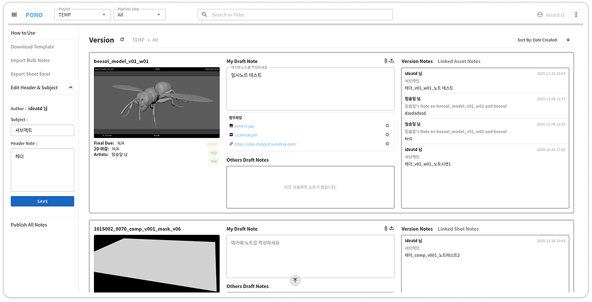

# PONO


  

**VFX Pipeline용 통합 노트·리뷰 서버 — FastAPI + Vue 3 + PostgreSQL 기반의 스튜디오용 협업 시스템.**    
 
ShotGrid의 샷 및 버전 정보를 활용하여, 사용자들이 특정 버전에 대한 임시 노트를 실시간으로 작성하고 관리할 수 있는 웹 싱글 페이지 애플리케이션  



<br>

## 목차
- [소개](#소개)
- [기술 스택](#기술-스택)
- [설치 및 시작](#설치-및-시작)
- [사용법](#사용법)
- [IP](#ip)
- [개발자 참고사항](#개발자-참고사항)

<br>

## 소개
PONO는 스튜디오 내부에서 **ShotGrid 노트 및 버전 리뷰를 대체**하기 위해 개발된  
VFX 전용 웹 플랫폼입니다.  
FastAPI 백엔드와 Vue 3 프론트엔드를 결합해 임시노트 작성, 빠른 노트 검색, 버전 링크, 첨부파일 관리,  
리뷰 플로우 자동화 등을 제공합니다.

<br>

## 기술 스택
| 구분 | 기술 |
|------|------|
| Backend | Python 3.10 / FastAPI / SQLAlchemy / Alembic |
| Frontend | Vue 3 / Vuetify 3 / Vue CLI |
| Database | PostgreSQL 15 |
| Infra | Rocky Linux 9.5 / Screen / Nginx |

<br>

## 설치 및 자동 재시작
> 최초 설치 방법은 [**`Getting_Started.md`**](./docs/Getting_Started.md)참고  
> Backend, Frontend 수동 실행은 [**`./backend/README.md`**](./backend/README.md) 참고
    
### 변경된 Code 적용 및 서버 재시작
1. PONO서버 접속
2. pono프로젝트 경로 들어가기
3. Git에서 변경사항 pull받기
4. 아래 명령어 입력

    ```bash
    cd pono
    source ./config.sh
    cd "$BACKEND_DIR"
    ./bin/pono_launcher.sh
    ```
### Backend만 재실행
```bash
cd pono
source ./config.sh
cd "$BACKEND_DIR"
./bin/pono_backend.sh
```
### Frontend만 재실행
```bash
cd pono
source ./config.sh
cd "$BACKEND_DIR"
./bin/pono_frontend.sh
```

<br>

## 사용법
웹 주소창에 10.0.1.110:8080 입력 후 접속
>자세한 사항은 [**`User_Manual.md`**](./docs/User_Manual.md) 참고
<br>

## IP
### 개발 서버
- Backend : 30.0.1.141:8000
- Frontend : 30.0.1.141:8080

### PONO 서버
- Backend : 10.0.1.110:8000
- Frontend : 10.0.1.110:8080

<br>

## 개발자 참고사항
>자세한 사항은 [**`Development_Guide.md`**](./docs/Development_Guide.md) 참고  


