# PONO 사용자 메뉴얼

### 목차
* [1. PONO란?](#1-pono란)
* [2. 화면 둘러보기](#2-화면-둘러보기)
  * [2.1 상단 메뉴](#21-상단-메뉴)
  * [2.2 사이드바](#22-사이드바)
  * [2.3 메인 작업 영역](#23-메인-작업-영역)
* [3. 버전 카드 상세 설명](#3-버전-카드-상세-설명)
* [4. 상세 기능 사용법](#4-상세-기능-사용법)
  * [4.1 상단 메뉴 검색창(Search Bar)](#41-상단-메뉴-검색창search-bar)
  * [4.2 파일 및 URL 첨부하기](#42-파일-및-url-첨부하기)
  * [4.3 노트 Subject & Header 설정하기](#43-노트-subject--header-설정하기)
  * [4.4 단일 노트 ShotGrid에 게시하기 (Publish)](#44-단일-노트-shotgrid에-게시하기-publish)
  * [4.5 여러 노트 한번에 게시하기 (Publish All)](#45-여러-노트-한번에-게시하기-all-notes-publish)

---
<br><br>

## 1. PONO란?

PONO는 VFX 작업물의 버전을 확인하며, 팀원들과 실시간으로 의견을 주고받을 수 있는 **실시간 협업 노트 시스템**입니다. 기존 ShotGrid에 노트를 남기기 전, 빠르고 간편하게 아이디어나 수정사항을 기록하고 공유할 수 있습니다. PONO에 작성한 임시 노트는 언제든지 정식 ShotGrid 노트로 발행(Publish)할 수 있습니다.

### 실시간 임시 노트:  
특정 버전에 대해 임시 노트를 작성하면, 다른 팀원들이 별도의 새로고침 없이 즉시 해당 내용을 확인할 수 있습니다.   
웹페이지를 떠나도 임시노트는 자동으로 저장되어 유지됩니다.

### 파일 첨부:  
노트에 이미지, 동영상, 문서 등 다양한 파일을 쉽게 첨부하고 공유할 수 있습니다.

### Shotgrid 정보 확인:  
현재 버전의 간단한 필드 정보와 노트는 물론, 그 버전에 연결된 샷(Shot) 또는 에셋(Asset)의 노트들까지 한눈에 볼 수 있습니다.

### 다중 필터링:  
상단의 프로젝트와 파이프라인 스텝을 선택하면 관련된 버전 목록이 생성됩니다. 또한, 다중 필터링 기능을 통해 이 목록에서 내가 원하는 버전만 정확히 찾아볼 수 있습니다.

### 노트 게시(Publish):
개별 노트 또는 전체 노트를 게시하기 전 본인이 쓴 노트의 최종 결과물을 확인할 수 있습니다.  
전체 노트에 적용되는 Subject와 Header Note(머릿말) 별도 지정이 가능합니다.  
게시된 노트는 Shotgrid에 Notes로 올라가게 되며 연결된 버전과 To, CC등을 자동으로 구성해줍니다.

<br>

## 2. 화면 둘러보기

PONO는 **샷그리드 ID, Password**를 사용합니다.   
로그인이 안되는 분들은 [ShotGrid Legacy Login](http://10.0.1.101/books/shotgrid/page/shotgrid-legacy-login-personal-access-token) 설정을 확인해주세요. 

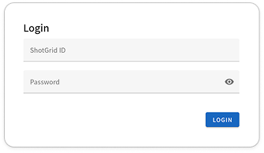

PONO의 화면은 크게 **상단 메뉴**, **사이드바**, **메인 작업 영역**으로 나뉩니다.
<br>

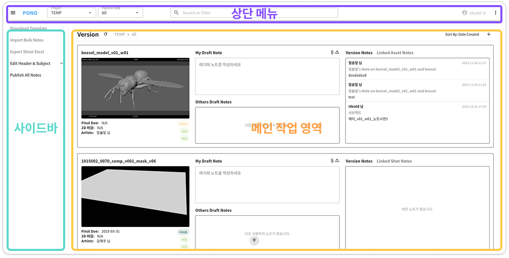

## 2.1 상단 메뉴
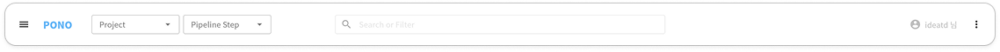
<br>

화면 최상단에 위치하며, 데이터 초기 필터링 및 설정 기능을 담당합니다.

- ### Project 선택  
    현재 작업 중인 ShotGrid 프로젝트를 선택합니다. 샷그리드에서 active된 프로젝트 목록만 확인하실 수 있습니다.

- ### Pipeline Step 선택
    `comp`, `light`, `anim` 등 Pipeline Step을 선택하여 해당 스텝의 버전만 필터링하여 볼 수 있습니다.  
    `All` 선택 시 모든 스텝이 표시됩니다.

- ### 검색창
    버전 이름, 샷 이름, 태스크 이름 등으로 특정 버전을 빠르게 검색합니다. 다중 검색이 가능합니다.  
    [**→ 검색창 사용방법**](#41-상단-메뉴-검색창search-bar)

- ### 유저 정보
    현재 로그인한 유저의 이름을 확인할 수 있습니다.

<br>

### 글로벌 옵션 (⋮)

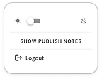

- ### 다크/라이트 모드 토글 (☀️/🌙)
    아이콘을 클릭하여 어두운 화면 또는 밝은 화면으로 테마를 전환할 수 있습니다.  
    **(기본 셋팅값 - 시스템 셋팅)**

- ### SHOW/HIDE PUBLISH NOTES
    버전 노트 및 연결된 샷 또는 에셋 노트에서 Subject에 [Publish]가 들어간 노트들을 보이거나 숨겨줍니다.  
    **(기본 셋팅값 - 숨김)**

- ### 로그아웃
    클릭 시 로그아웃할 수 있습니다.

<br>

## 2.2 사이드바

화면 왼쪽에 위치하며, 노트 게시와 관련된 고급 기능을 제공합니다.

```
Edit Header & Subject, Publish All Notes 기능 개발 완료 [2025.11.06]
Download Template,  Import Bulk Notes, Export Sheet Excel 추후 개발 예정
```
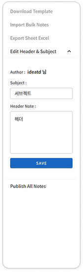

- ### Header & Subject Editor
    노트를 게시할 때 사용될 **Subject**와 **Header Note**를 미리 설정하는 기능입니다.  
    반복적인 입력을 자동화하여 작업 시간을 단축하고, 노트의 일관성을 유지할 수 있습니다.

    [**→ 게시용 노트 제목 및 헤더 설정하기**](#43-노트-subject--header-설정하기)

- ### Publish All Notes

    상단 메뉴에서 선택한 프로젝트와 파이프라인 스텝에 해당하는 나의 모든 임시 노트(`My Draft Note`)를 한 번에 ShotGrid에 게시합니다.  

    예를 들어, 'Project A'의 'comp' 스텝을 선택했다면, 해당 스텝에 속한 모든 버전에 내가 작성한 모든 임시노트가 게시 대상이 됩니다. 검색창 필터링이나 화면의 페이지 번호와는 관계없이, 선택된 스텝 전체에 대한 노트를 한 번에 정리할 때 사용하는 기능입니다.

    [**→ 여러 노트 한번에 게시하기 (Publish All)**](#45-여러-노트-한번에-게시하기-all-notes-publish)

<br>

## 2.3 메인 작업 영역

화면의 가장 넓은 영역으로, 프로젝트와 파이프라인 스텝으로 필터링된 버전들이 카드 형태로 나타납니다.  
상단메뉴 검색창에서 필터 옵션을 선택한 경우 그에 맞는 버전만 보여집니다.  

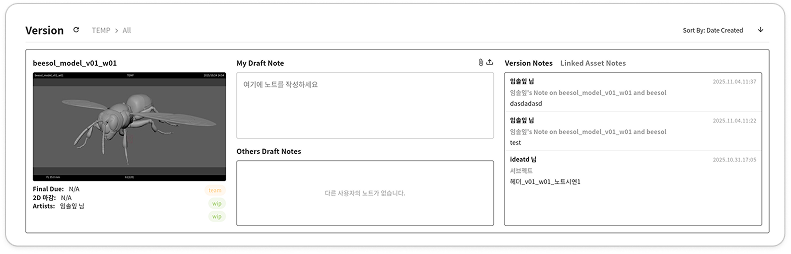

버전 리스트는 10분간 캐싱된 데이터를 사용합니다. **(⚠️최신 데이터가 아닐 수 있음 주의)**   
Version 글씨 옆 새로고침 버튼 클릭 시 현재 샷그리드의 최신 버전 데이터를 바로 불러올 수 있습니다.  

우측 상단에서 정렬 방법과 오름차순/내림차순을 선택할 수 있습니다.  
**(기본 셋팅값 - Date Created, 내림차순)**

[정렬기준]
- Version - Name : 버전 이름
- Shot - Rnum : 샷 롤넘버
- Shot - Name : 샷 이름
- Asset - Name : 에셋 이름
- Date Created : 생성 날짜

각 버전의 상세 정보는 하나의 **버전 카드** 안에 담겨 있습니다.  
[**→ 버전 카드 상세 설명**](#3-버전-카드-상세-설명)

버전 목록은 한 페이지 기준 **50개씩** 보여집니다. 목록이 길어질 경우, 하단의 페이지 번호나 화살표를 클릭하여 다른 페이지의 버전들을 볼 수 있습니다.  
화면 하단 중앙 플로팅 버튼을 클릭하면 버전 목록의 최상단으로 이동이 가능합니다.  

<br>

## 3. 버전 카드 상세 설명

하나의 버전 카드는 다시 여러 개의 주요 정보 영역으로 나뉩니다.


- ### Version Fields Data

    버전의 핵심 정보(썸네일, 버전이름, 상태(Status), 최종 수정일 등)를 보여주는 영역입니다.  

    Status는 위에서부터 차례로 **Version, Shot/Asset, Task 순**으로 배치되어 있습니다.  
    각 버전의 상태(Status) 위에 마우스 커서를 올리면, 해당 상태에 대한 자세한 설명을 툴팁으로 확인할 수 있습니다.

- ### My Draft Note**
    해당 버전에 대해 작성하는 나의 임시 노트 영역입니다.  

    입력, 수정 및 삭제가 가능합니다.  
    입력이 끝나고 잠시 기다리면 **자동으로 저장**되며, **실시간**으로 다른 사람들의 노트에 해당 내용이 **업데이트** 됩니다. 저장되는 시점은 색상 변화로 확인할 수 있습니다.  
    상단 클립 모양 버튼(📎)을 이용하여 내 노트에 첨부파일을 추가할 수 있습니다.  
    [**→ 파일 및 URL 첨부하기**](#42-파일-및-url-첨부하기)

- ### Others Draft Notes**
    다른 팀원들이 해당 버전에 대해 작성한 임시 노트를 실시간으로 보여주는 영역입니다.  

    다른 사람의 노트는 수정 및 삭제가 불가능합니다.  
    **작성자 이름, ID, 시간, 노트 내용 및 첨부파일** 정보를 확인 할 수 있습니다.  
    최신 작성한 노트 기준 내림차순으로 정렬됩니다.  
    다른 사용자가 노트를 생성하거나 수정할 경우 **실시간으로 내용이 업데이트** 됩니다.  
    확인 하지 않은 노트는 노란 색상으로 표시됩니다. 영역 위에서 클릭 또는 스크롤을 할 경우 색상 표시가 사라집니다.

- ### Version Notes
    ShotGrid에 정식으로 등록된 해당 버전의 노트들을 보여주는 영역입니다.  
    노트의 제목, 내용, 작성자, 작성시간 등을 확인할 수 있습니다. (이곳의 노트는 PONO에서 수정할 수 없습니다.)

    Publish 노트들은 기본적으로 숨김처리 되어있습니다. 옵션 설정을 바꾸고 싶으시면 링크를 참고해주세요.  
    [**→ SHOW/HIDE PUBLISH NOTES**](#showhide-publish-notes)

- ### Linked Shot/Asset Notes

    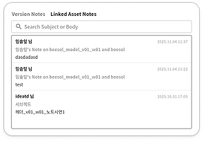

    해당 버전이 속한 **샷(Shot) 또는 에셋(Asset)** 에 연결된 다른 ShotGrid 노트들을 보여주는 영역입니다.  (이곳의 노트는 PONO에서 수정할 수 없습니다.)
    버전 자체가 아닌, 더 상위 개념에 연결된 노트를 참고할 때 유용합니다.

    **노트 검색창**에서 Subject 또는 Body에 포함된 단어를 검색하여 노트 목록을 필터링 할 수 있습니다.  
    노트의 제목, 내용, 작성자, 작성시간 등을 확인할 수 있습니다. (이곳의 노트는 PONO에서 수정할 수 없습니다.)  

    Publish 노트들은 기본적으로 숨김처리 되어있습니다. 옵션 설정을 바꾸고 싶으시면 링크를 참고해주세요.  
    [**→ SHOW/HIDE PUBLISH NOTES**](#showhide-publish-notes)

<br>

## 4. 상세 기능 사용법

## **4.1 상단 메뉴 검색창(Search Bar)**


프로젝트와 파이프라인스텝으로 리스트업된 버전 내에서 여러 조건을 조합하여 원하는 버전을 정확하게 찾을 수 있습니다.  
검색창 필터는 현재 화면에 표시되는 버전 목록에만 적용되며, 'Publish All Notes' 기능에는 영향을 주지 않습니다.

### 1. 필터 타입 선택: 
검색창을 클릭하거나 타이핑을 시작하면, 'Task', 'Shot', 'Asset', 'Version', 'Subject',
'Tag' 등 사용 가능한 필터 타입 목록이 나타납니다. 원하는 타입을 선택합니다.

### 2. 값 입력: 
필터 타입을 선택하면, 해당 타입에 맞는 값을 입력할 수 있는 모드로 전환됩니다. 예를 들어 'Shot'
타입을 선택했다면, 'PNI_0010'과 같은 샷 이름을 입력합니다. 입력 중에도 관련 제안 목록이 나타나며, 목록에서 선택하거나 직접 값을 입력할 수 있습니다.

### 3. 필터 추가: 
값을 확정하면 '타입: 값' 형태의 칩(Chip)이 검색창에 추가됩니다. 이 과정을 반복하여 여러 필터 조건을 조합할 수 있습니다.

### 4. 검색 실행: 
모든 필터 조건 입력을 마친 후 **`Enter`** 키를 누르면, 설정된 필터에 따라 버전 목록이 새로고침 됩니다.

### 5. 필터 제거: 
추가된 칩의 'X' 버튼을 클릭하거나, Backspace 키를 누르면 마지막 필터부터 하나씩 제거됩니다. 검색창의 모든 필터를 지우고 **`Enter`** 키를 누르면 필터가 적용되지 않은 모든 버전 목록이 보여집니다.

### 예시)
'Shot: PNI_0010'과 'Tag: Review' 필터를 추가하면, 'PNI_0010' 샷에 속하면서 'Review' 태그가 있는 버전들만 목록에 표시됩니다.

<br>

## **4.2 파일 및 URL 첨부하기**
임시 노트에 파일 또는 URL을 직접 첨부할 수 있습니다. 첨부한 내용은 목록에서 클릭해 확인 및 다운로드가 가능합니다.  

### 1. 첨부파일 창 열기
`My Draft Note` 입력창 우측 상단의 **클립 모양 아이콘 (`📎`)** 을 클릭합니다.

### 2. 파일 첨부하기
팝업창에서 상단 첫번째 **클립 모양 입력창**을 누르거나 파일을 직접 드래그 앤 드롭해 파일을 업로드합니다.

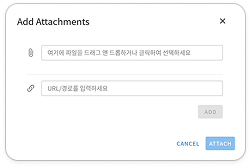 

### 3. 웹주소 또는 파일 경로 추가하기
팝업창에서 상단 두번째 **링크 모양 입력창**을 누르고 URL 또는 파일 경로를 입력한 뒤 **`ADD`** 버튼을 누릅니다.

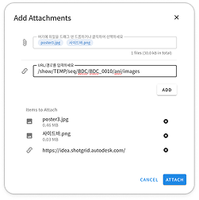

### 4. 파일 첨부 확정
하단 `Items to Attach` 에서 첨부된 파일 목록을 확인합니다. 첨부하지 않을 아이템은 **`X`** 버튼을 눌러 목록에서 제외시킵니다.

첨부가 완료되면 **`ATTACH`** 버튼을 누릅니다. 노트 입력창 아래에 첨부 파일 목록이 나타납니다.

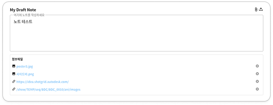

<br>

## **4.3 노트 Subject & Header 설정하기**
임시 노트를 게시할 때 사용될 **Subject**와 **Header Note**를 미리 설정하는 기능입니다.  
반복적인 입력을 자동화하여 작업 시간을 단축하고, 노트의 일관성을 유지할 수 있습니다.  

한 번 설정해두면 게시(Publish)될 모든 임시 노트의 Subject와 Header에 일괄 적용됩니다.  


**Subject** : 샷그리드 노트의 Subject 필드에 들어갈 노트의 제목입니다.  
**Header Note** : 헤더 노트란 작성한 모든 임시 노트 내용 앞에 추가되는 텍스트입니다.    

### 1. Edit Header & Subject 창 열기
상단 메뉴 가장 좌측 **`메뉴(☰)`** 버튼을 눌러 왼쪽 사이드바를 열어줍니다. **`Header Subject Editor`** 버튼을 클릭합니다.

### 2. 정보확인
Author에 본인의 이름이 적혀있는지 확인합니다.

### 3. Subject & Header Note 작성
임시 노트에 일괄 적용할 Subject와 Header Note를 작성합니다.  
헤더 노트는 `Header Note`\_`Task`\_`v00`의 형태로 추후 Publish되는 모든 노트 앞에 삽입 됩니다.  


### 4. 저장하기
**`SAVE`** 버튼을 누르면, 이후 Publish 팝업창이 열릴 때마다 이곳에 설정된 양식이 자동으로 채워집니다.  
Subject 또는 Header를 사용하지 않을 경우 칸을 비워서 저장합니다.

> ⚠️ **작성 및 수정 후 **`SAVE`** 버튼을 꼭 눌러주셔야 노트에 반영이 됩니다**.


<br>

## **4.4 단일 노트 ShotGrid에 게시하기 (Publish)**
작성한 개별 임시 노트를 ShotGrid의 정식 노트로 발행하는 기능입니다.  
게시 직전 별도의 팝업창에서 노트 내용과 첨부파일을 마지막으로 수정할 수 있습니다.

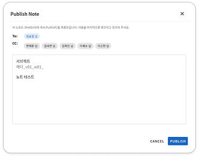


### 1. 팝업창 열기   
게시를 원하는 버전 카드의 My Draft Note 상단 우측 첨부파일 버튼 옆 **`게시(↥)` 아이콘**을 클릭합니다.

### 2. 최종 내용 확인 및 수정  
게시 팝업창은 ShotGrid에 전달될 최종 결과물을 미리 보여주는 공간입니다. 이곳에서 노트 내용(Content)을
마지막으로 수정하거나, 불필요한 첨부파일을 제거할 수 있습니다.

- **To/CC :** To에는 버전의 담당 아티스트, CC에는 해당 아티스트의 팀 리더 및 프로젝트의 슈퍼바이저 등이 자동으로 지정됩니다.
- **Subject 및 Header :** `Edit Header & Subject`에서 설정한 양식이 자동으로 적용됩니다.

### 3. ShotGrid에 게시하기  
하단의 **`PUBLISH`** 버튼을 누르면 게시가 시작됩니다.   
게시가 진행되는 동안에는 로딩 아이콘이 표시되며, 완료될 때까지 다른 동작을 할 수 없습니다.

### 4. 게시 결과 확인  
- **성공 시:**   
"Publish complete" 메시지가 나타난 후 팝업창이 자동으로 닫힙니다. `My Draft Note`에 있던 임시 노트와 첨부파일은 사라지고, `Version Notes` 영역에서 해당 노트를 확인할 수 있습니다.

- **실패 시:**  
팝업창 내에 "Publish complete. ... Failed: 1" 과 같은 경고 메시지가 나타납니다. 게시되지 않은 노트는 `My Draft Note`에서 사라지지 않습니다.
    > ⚠️ **문제가 지속 될 시 Pipeline 팀에 문의하세요.**


<br>

## **4.5 여러 노트 한번에 게시하기 (All Notes Publish)**
  여러 페이지에 흩어져 있는 나의 모든 임시 노트를 한 번에 ShotGrid에 게시하는 기능입니다.  
  상단 메뉴에서 선택한 **프로젝트**와 **파이프라인 스텝**에 해당하는 모든 임시 노트가 게시 대상이 됩니다. 

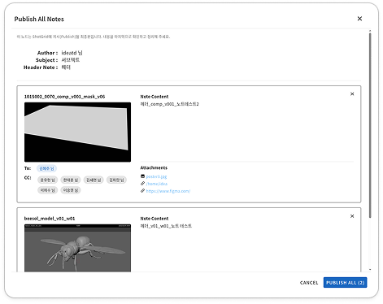


### 1. 팝업창 열기
왼쪽 사이드바에서 **`Publish All Notes`** 버튼을 클릭합니다.

### 2. 게시할 노트 목록 확인 및 제외
팝업창에 게시 대상 노트들이 각각의 카드 형태로 목록에 나타납니다. 각 카드에는 버전 정보, To/CC, 노트 내용, 첨부파일이 표시됩니다.
* 내용 수정은 불가능하며, 최종 내용을 확인하는 용도입니다.
* 게시하고 싶지 않은 노트가 있다면, 해당 카드의 우측 상단 `X` 버튼을 눌러 목록에서 제외할 수 있습니다.

### 3. ShotGrid에 게시하기
하단의 **`PUBLISH ALL`** 버튼을 누르면, 목록에 남아있는 모든 노트의 게시가 시작됩니다.

### 4. 게시 결과 확인
- **성공 시:**  
팝업창 내에 "Publish complete" 메시지와 함께 성공적으로 게시된 노트 수가 표시됩니다.   
모든 노트가 Publish에 성공하면 팝업창이 자동으로 닫힙니다.   
게시된 노트들은 `My Draft Note`에 있던 임시 노트와 첨부파일이 사라지고, `Version Notes` 영역에서 해당 노트를 확인할 수 있습니다.

- **실패 시:**   
팝업창 내에 "Publish complete. ... Failed: [실패한 노트 수]" 와 같은 경고 메시지가 나타납니다.    
게시되지 않은 노트를 팝업창에서 확인 하실 수 있습니다.   
게시되지 않은 노트는 `My Draft Note`에서 사라지지 않습니다.
    > ⚠️ **문제가 지속될 시 Pipeline 팀에 문의하세요.**
